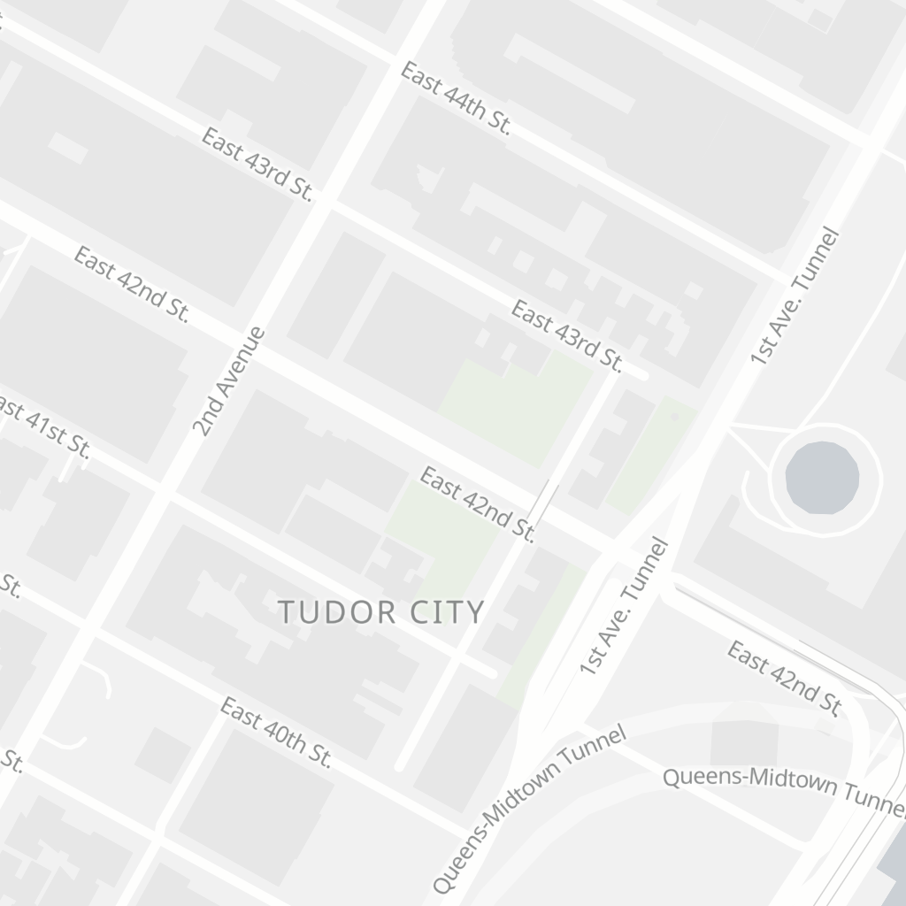

Cartago Map Styles
==================

A set of map styles for modern vector tile based maps. The styles have
been written for use with [Tileserver GL](http://tileserver.org/) and
[OpenMapTiles](https://openmaptiles.org/) vector tiles, but might work
with small modifications with other servers or tiles.




For local development, download the planet from openmaptiles.com, save
(or symlink) it as `mbtiles/planet.mbtiles` and start the server.

```bash
make [PORT=8080] serve
```

`make serve` runs Tileserver GL via nodemon so that the server is
restarted as you edit the style definition files. You can use either the
Leaflet based `test-raster.html`, Mapbox GL based `test-vector.html` or
Tileserver GL's built-in viewers available at <http://localhost:8080/>
to view the map rendered with a particular style.

Cartago Styles is released under the MIT License, see the file
[`COPYING`](COPYING) for details. Fonts and icons are bundled from
external sources, see the `fonts` and `sprites` directories for their
origins and licenses.

## Demos

* <http://cartago.io/maps/vector/>
* <http://cartago.io/maps/raster/>

## Resources

* <https://editor.openmaptiles.org/>
* <https://openmaptiles.com/>
* <https://openmaptiles.org/>
* <https://openmaptiles.org/schema/>
* <https://tileserver.readthedocs.io/en/latest/>
* <https://www.mapbox.com/mapbox-gl-js/style-spec/>
